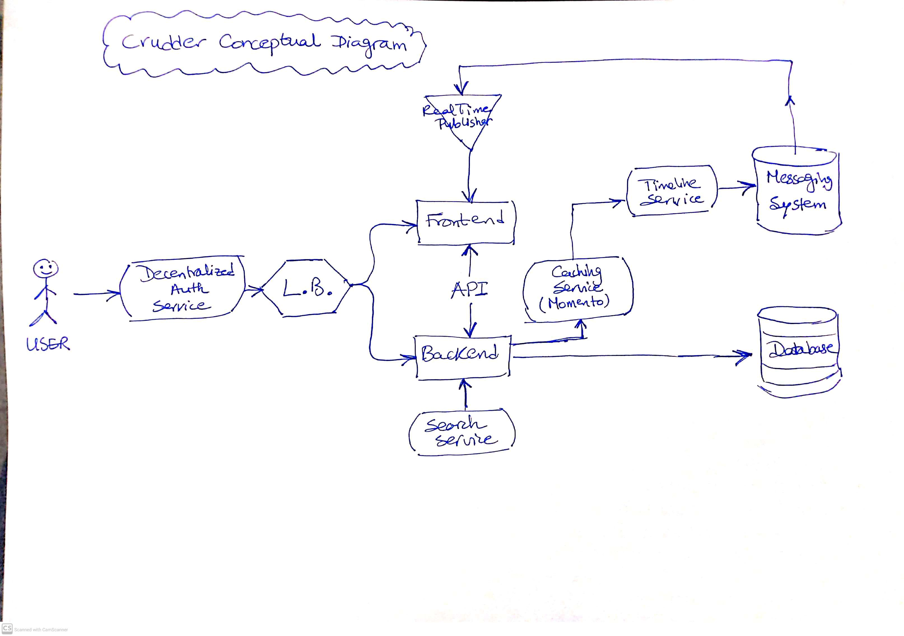
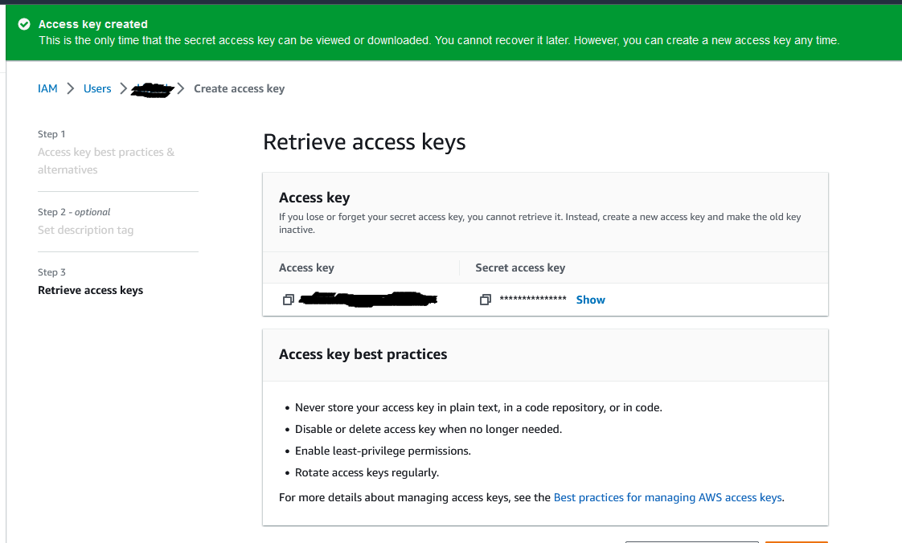
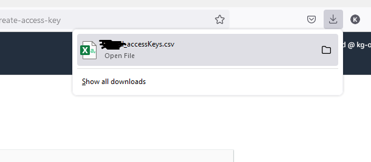

# Week 0 — Billing and Architecture

## Completed

### Completed the pre-requesite preparation, for example:
- Github repo creation (Copied the template).
- Gitpod account (Created a new account).
- Lucid charts account (Aleady have one).

- Homework
  - Create the Concpetual Diagram (Lucidcharts): 
      - [Crudder Conceptual Diagram](https://lucid.app/lucidchart/f203786a-fc53-4152-8fdb-e3f077c42d55/edit?viewport_loc=-483%2C-88%2C2888%2C1399%2C0_0&invitationId=inv_28446d0f-be13-468f-89dc-60d66cbc159c)
 
 - Create the Napkin conceptual diagram (Handwritten):
    - 
    - [Napkin Conceptual Diagram - pdf](crudder-week-0/aws-bootcamp-crudder-week0-conceptual-diagram.pdf)

 
 - Create the Architectural Diagram
    - [Crudder Architectural Diagram](https://lucid.app/lucidchart/c60ca83a-459e-4b4a-b841-1af2337bc6f8/edit?view_items=fN-xuBIOeu4n&invitationId=inv_0107733e-0c0e-4dfc-bd55-7b9cf82fef57)

### Cloud shell
~~~
[cloudshell-user@ip-10-4-x-x ~]$ aws --cli-auto-prompt                                                                                                                                                                   
> aws sts get-caller-identity
{
    "UserId": "AIDA***********4ATO",
    "Account": "28*******9443",
    "Arn": "arn:aws:iam::28******9443:user/khalid"
}
[cloudshell-user@ip-10-4-x-x ~]$
~~~

### Generate AWS Credentials

Here are 2 screenshots showing the creatin process
The first one is for creating the credentials from the aws console
The second is showing the csv file after downloading

    - 
    - 

### Billing Alarms and Budgets

Here are 2 screenshots showing the creatin process
The first one is for creating 2 budgets (monthly and zero-spend) from the aws console
The second is showing the Billing alarm created from cloudwatch

    - 
    - .png

## Next Week preparation 
  - Docker Review
