# Week 1 — App Containerization

# Summary (skip to Details section below if already read on student portal)

## 1. Done (Homework)
- Finished everything within the checklist. 
- Submitted the 2 quizes on time. 
- Further details are explained within the student log (Student journal) for week-1

## 2. Done - Homework Challenges
- Expoloring other Cloud Environemnts
    - Researching OCI (Oracle Cloud Infrstrucutre) Application express & Open source CodeServer.

## 3. Problems
- Nothing Major. Some minor problems were faced but I managed my way to solve them.

## 4. What's next?
- Check if I can created another new AWS account instead of the blocked one in order to extend the free-tier. 
- Observaility (week 02).

# Details

### During Live Session

During week-1 live sesion, I managed to follow-up and do all the steps (with a slight delay). I managed to get both Containers for the backend flask webapp and the frontend React app about 1.5 hour after the live session.

Below are screen shots for the first run of crudder home page and signup page directly after the session
1. Crudder Home page 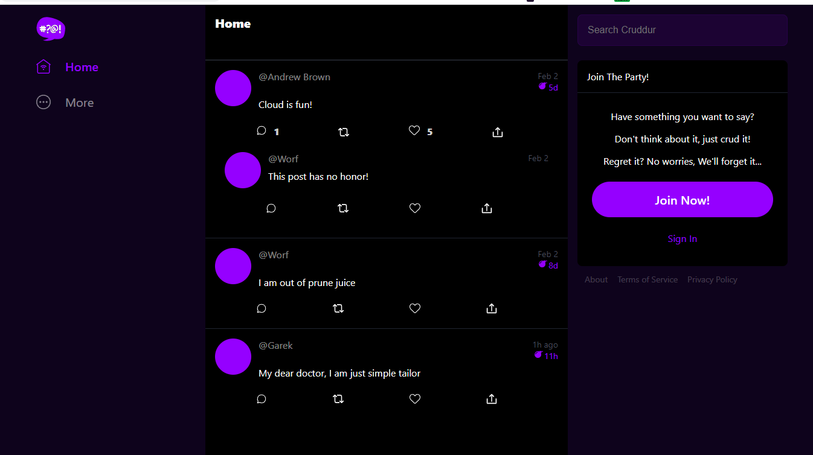
2. Crudder Signup page 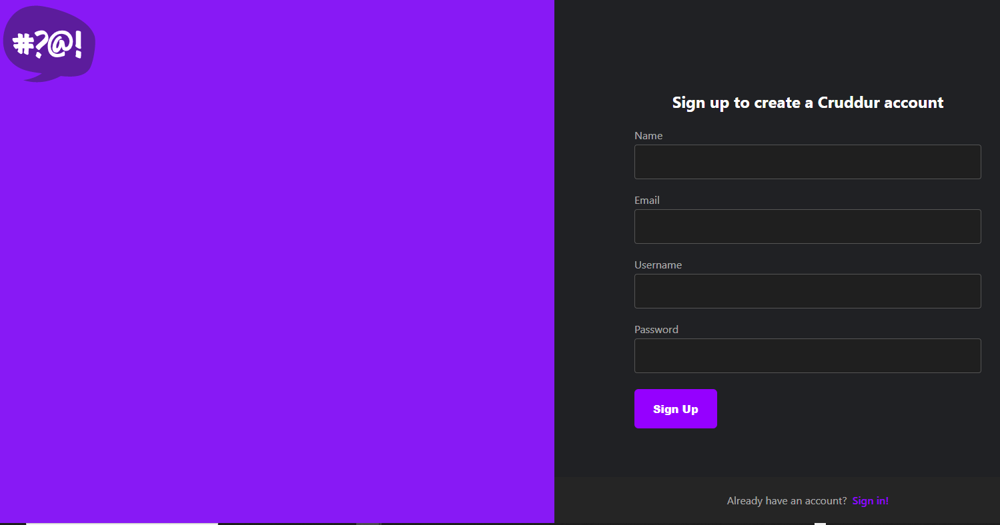

### Code Commit best practice

Concercing code commit, I already have my own best practices and thats why I commited my own code before watching Andrew's first video after the session reminding everyone to commit code before the environmnet is destroyed.

### Notfications feature
I watched the notification video and managed to add integrate the notification feature into both the frontend and backend. No major issues were faced.

Screen shots for notification feature:

1. Crudder Notifications from frontend
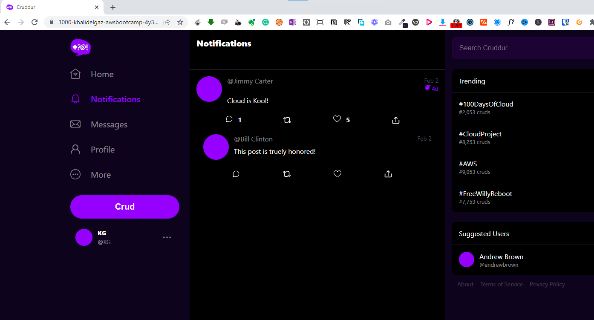

2. Crudder Notifications (backend)

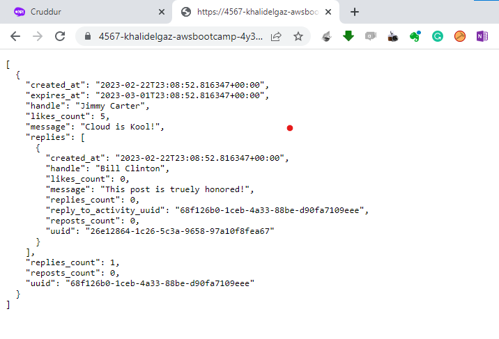

### Containerizing Databases (DynamoDB, Postgress) and installing AWS-CLI  on Gitpod

I followed the video and all went well.

Screen shots for adding the databases:

1. Installing Postgress on gitpod 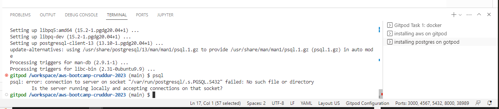

2. Installing aws-cli on gitpod 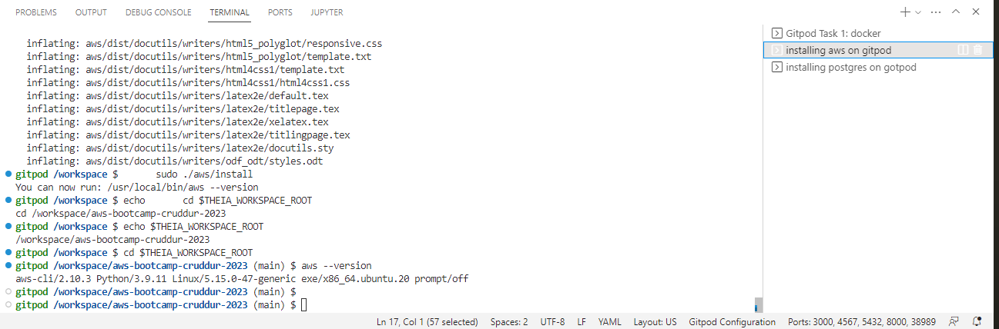

3. Ensure having both aws-cli and postgress in gitpod startup scripts 

4. Adding postgres to vscode extensions 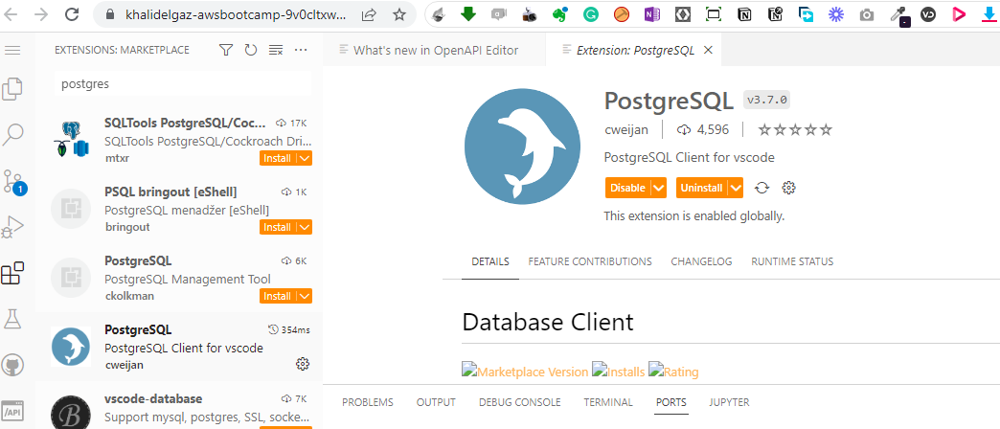

After that I made two tests (one from the gitpos vscode terminal and the second from database explore) to ensure that postgress is working.

Screenshots are shown below:

1. Getting postgres to work as container from gitpod terminal 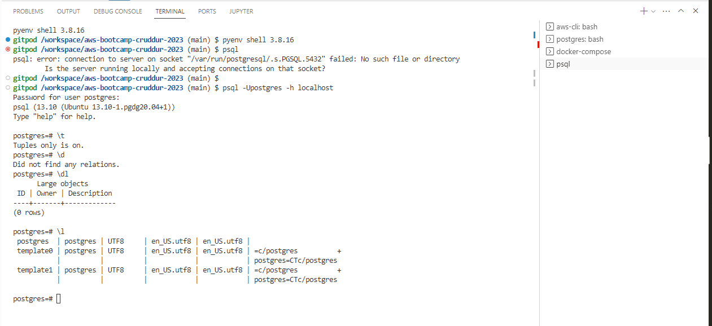

2. Getting postgres to work as container from gitpod db explorer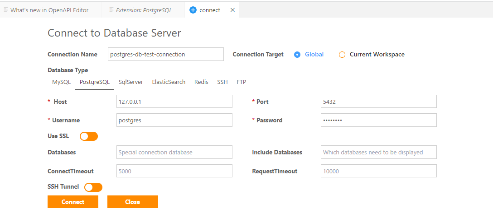

3. Sucessful connection from gitpod db explorer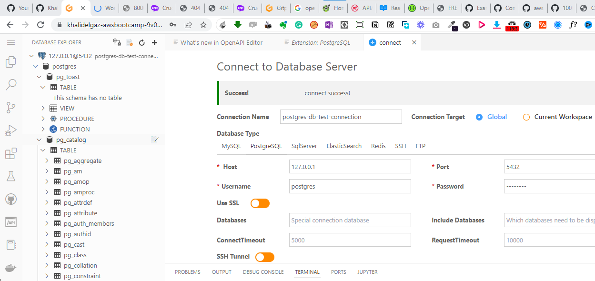

### Playing around with Dynamo DB

I followed the video and all went well. The following screenshots shows 
- Table creation
- Creating item
- listing table
- Listing Music table

Screenshots for testing DynamoDB:

1. Table creation 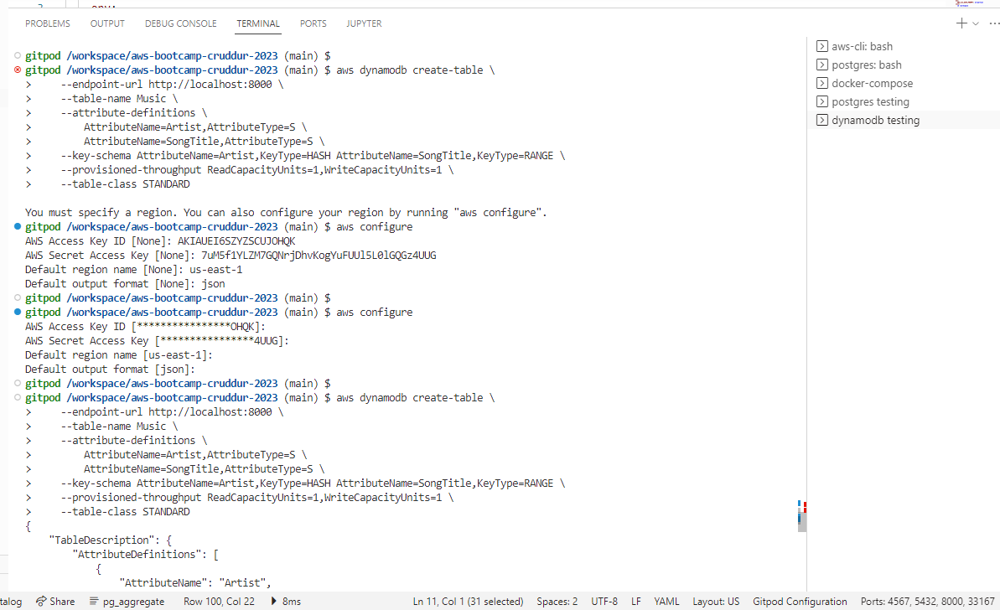

2. Item Creation 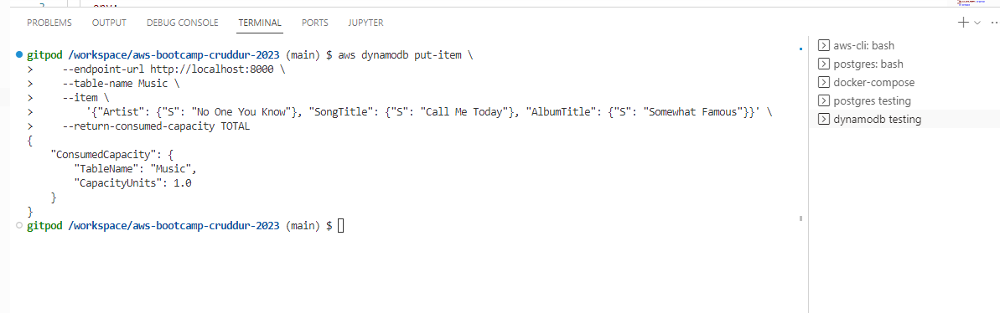

3. Listing Table 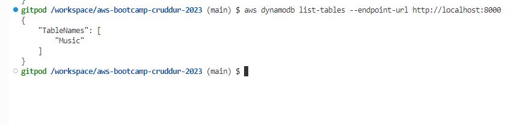

4. Listing Music Table 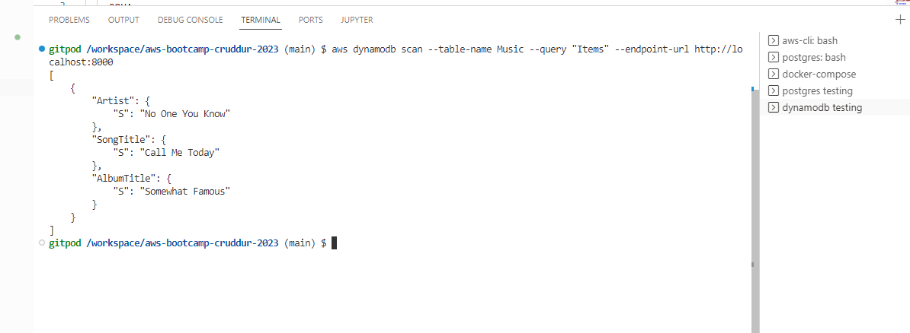

